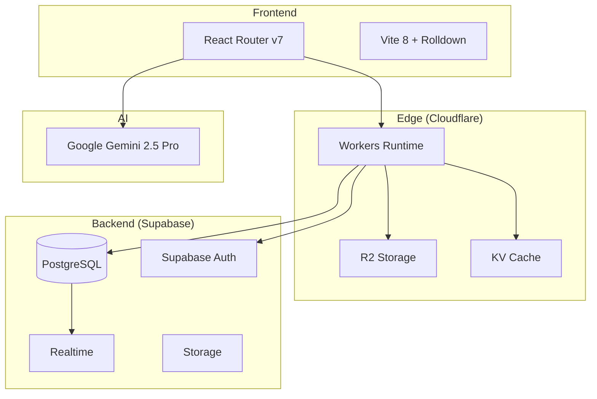

# GRIXI — Plataforma Empresarial Inteligente

> La interconexión inteligente de toda la empresa.

[](https://workers.cloudflare.com/)
[](https://supabase.com/)
[](https://reactrouter.com/)
[](https://www.typescriptlang.org/)

---

## Arquitectura



## Stack Tecnológico

| Capa | Tecnología | Uso |
|------|-----------|-----|
| Runtime | Cloudflare Workers | Edge computing, SSR, API routes |
| Framework | React Router v7 | Full-stack React, file-based routing |
| Build | Vite 8 + Rolldown | Bundling ultra-rápido |
| Base de datos | Supabase (PostgreSQL) | Multi-tenant con RLS |
| Auth | Supabase Auth | Google OAuth PKCE |
| Storage | Cloudflare R2 | Avatares, logos, archivos |
| AI | Google Gemini 2.5 Pro | Chat, análisis, rich outputs |
| Notificaciones | Web Push + In-app | Push nativas + realtime |
| Email | Resend API | Transaccional (invitaciones) |
| CSS | Tailwind CSS v4 | Utility-first + design tokens |
| Domain | grixi.ai | Multi-tenant via subdomains |

## Módulos Activos

| Módulo | Estado | Descripción |
|--------|--------|-------------|
| 🔐 Auth | ✅ | Google OAuth, login history, session timeout |
| 📊 Dashboard | ✅ | KPIs reales, actividad en tiempo real |
| 💰 Finanzas | ✅ | Libro Mayor, CxC/CxP, análisis AI |
| 🤖 GRIXI AI | ✅ | Chat con Gemini, Canvas, rich outputs |
| ⚙️ Configuración | ✅ | Equipo, roles, permisos, perfil, auditoría |
| 🔔 Notificaciones | ✅ | Push + in-app, centro de notificaciones |
| 🛡 Admin Portal | ✅ | Gestión cross-tenant (admin.grixi.ai) |
| 📦 Almacenes | 🚧 | 3D Warehouse visualization |
| 🛒 Compras | 🚧 | Procurement & supply chain |
| 👥 Usuarios | 🚧 | HR module |

## Setup Local

### Prerrequisitos

- Node.js ≥ 22.x
- pnpm ≥ 9.x
- Cuenta Cloudflare con Workers
- Proyecto Supabase

### Instalación

```bash
# Clonar repositorio
git clone https://github.com/grixi/grixi-app.git
cd grixi-app

# Instalar dependencias
pnpm install

# Configurar variables de entorno
cp .dev.vars.example .dev.vars
# Editar .dev.vars con tus claves

# Generar tipos
pnpm typegen

# Iniciar en modo desarrollo
pnpm dev
```

### Variables de Entorno (`.dev.vars`)

```env
SUPABASE_URL=https://your-project.supabase.co
SUPABASE_ANON_KEY=your-anon-key
SUPABASE_SERVICE_ROLE_KEY=your-service-role-key
GEMINI_API_KEY=your-gemini-key
VAPID_PUBLIC_KEY=your-vapid-public
VAPID_PRIVATE_KEY=your-vapid-private
RESEND_API_KEY=your-resend-key
```

## Deploy

```bash
# Build de producción
pnpm build

# Deploy a Cloudflare Workers
npx wrangler deploy
```

O via CI/CD (GitHub Actions):

```bash
# Push a main → auto-deploy
git push origin main
```

## Estructura del Proyecto

```
GRIXI-APP/
├── app/                  # Código fuente React Router
│   ├── routes/           # File-based routing
│   ├── components/       # Componentes React
│   ├── lib/              # Utilidades, hooks, clients
│   └── app.css           # Design system + tokens
├── workers/              # Cloudflare Workers entry
│   └── app.ts            # Request handler + security
├── public/               # Assets estáticos + PWA
├── arquitectura/         # 15 documentos de arquitectura
├── docs/modulos/         # Documentación por módulo
├── registro/             # Bitácora + estado del proyecto
└── wrangler.jsonc        # Config Cloudflare
```

## Seguridad

- **Content Security Policy** estricto
- **Row Level Security (RLS)** en todas las tablas
- **RBAC** granular con 85+ permisos
- **Rate limiting** en rutas admin (30 req/min)
- **Cookie isolation** por subdomain (multi-tenant)
- **Session timeout** con warning visual
- **Audit logging** completo de todas las acciones
- **Domain whitelisting** por organización

## Licencia

Propiedad de GRIXI — Todos los derechos reservados.

---

<p align="center">
  <strong>GRIXI</strong> — La interconexión inteligente
</p>
